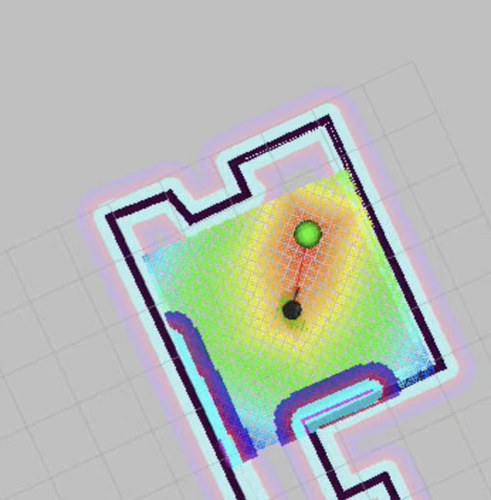
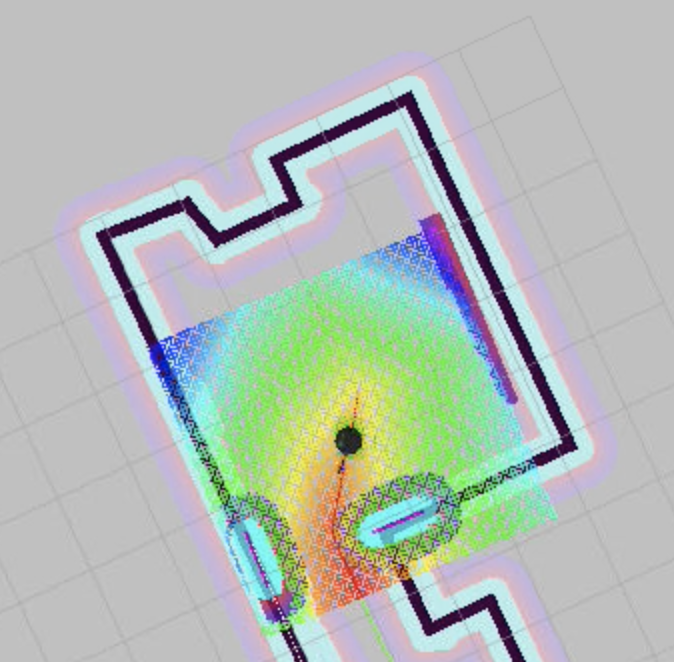
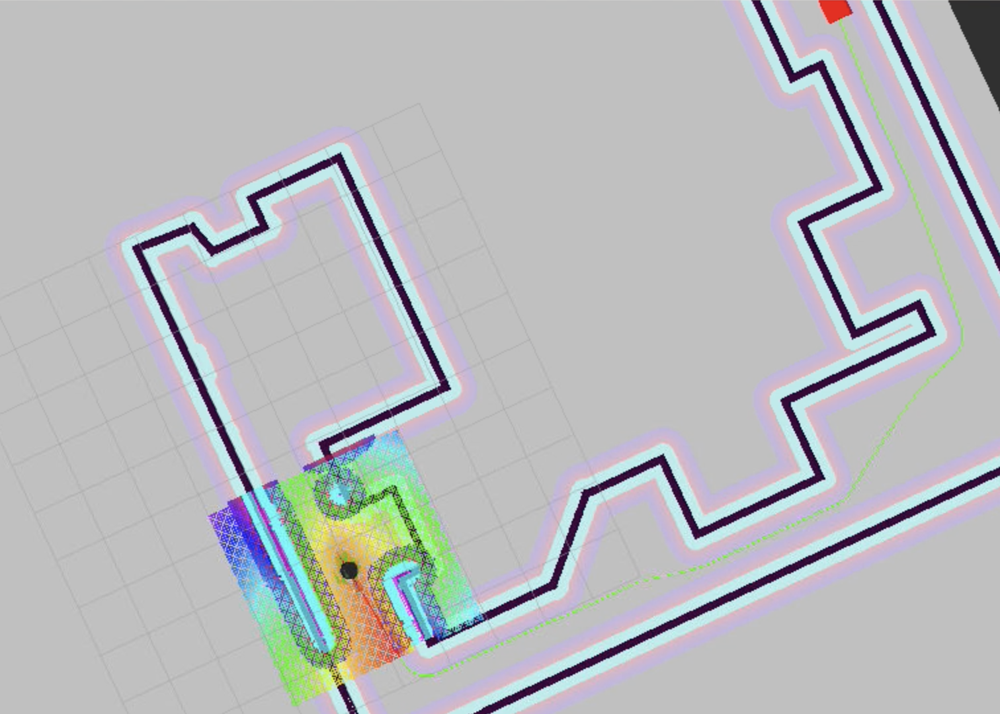
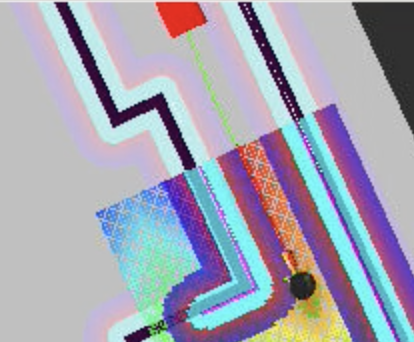
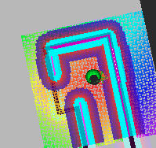

# Home Service Robot
This project aims to develop the simulation environment and code based in ROS for a home service robot which has the following modules:
* Localization
* Mapping
* Path planning 
* Navigation

## Packages
### Oficial ROS packages 
* **gmapping**: With the gmapping_demo.launch file, you can easily perform SLAM and build a map of the environment with a robot equipped with laser range finder sensors or RGB-D cameras.
You can see documentation on:
http://wiki.ros.org/gmapping

* **turtlebot_teleop**: With the keyboard_teleop.launch file, you can manually control a robot using keyboard commands.
You can see documentation on: http://wiki.ros.org/turtlebot_teleop

* **turtlebot_rviz_launchers**: With the view_navigation.launch file, you can load a preconfigured rviz workspace. You’ll save a lot of time by launching this file, because it will automatically load the robot model, trajectories, and map for you.
You can see documentation on: http://wiki.ros.org/turtlebot_rviz_launchers

* **turtlebot_gazebo**: With the turtlebot_world.launch you can deploy a turtlebot in a gazebo environment by linking the world file to it. It also employs MCL algorthim, the particule filter, to localize the robot through amcl_demo.launch file.
You can see documentation on: http://wiki.ros.org/turtlebot_rviz_launchers

### Self-developed packages
* **add_markers**: With this module, you can simulate pick and drop of a mobile robot with markers. A green spheric marker will simulate the object. A red cubic marker the drop position. 

* **pick_objects**: This module communicates with the ROS navigation stack and send goals to the robot, the drop off goal and the pick up goal. The ROS navigation stack creates a path for yuor robot based on Dijkstra's algorithm, a variant of Uniform Cost Sear2ch to avoid obstacles on its path.

## Results
Going to the pick up goal.

Object has been picked up and now, leaving the goal.

Heading to the drop off goal.

Arriving to the drop off goal.

Goal has been reached and object has been dropped off.

## Installation tips

When installing tutlrbot_gazebo you must install dependencies:
 
	rosdep -i install turtlebot_gazebo

After you should use command:
	
	catkin_make

To create a map you should install 
	sudo apt-get install libignition-math2-dev protobuf-compiler

Then, download pgm_map_creator to src folder:
	cd /home/workspace/catkin_ws/src/
	git clone https://github.com/udacity/pgm_map_creator.git

Copy the Gazebo world you created to the world folder

	cp catkin_ws/src/worlds/u.world 

Insert the map creator to map fil. Open map file using editor. Add the following tag towards the end of the file, just before </world> tag
	<plugin filename="libcollision_map_creator.so" name="collision_map_creator"/>

